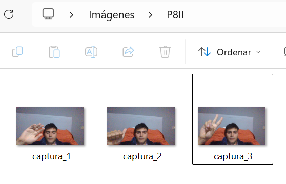

# P8-II-MicorfonoCamara

## Microfono

### Parte 1: Grabación con micrófono

<video src="img/1a.mp4" controls loop muted width="480">
    Tu navegador no soporta la reproducción de video incrustado. Puedes descargarlo desde `img/1a.mp4`.
</video>

Una vez configurados los componentes `AudioSource` y el dispositivo de entrada, utiliza el siguiente script `Recorder` para registrar audio desde el micrófono y reproducirlo en tiempo real.

```csharp
using System.Collections;
using System.Collections.Generic;
using UnityEngine;

public class Recorder : MonoBehaviour
{
    private AudioSource audioSource;

    
    void Start()
    {
        
        audioSource = GetComponent<AudioSource>();
        
        
        if (audioSource != null)
        {
            audioSource.playOnAwake = false;
            audioSource.Stop();
        }
        
        
        audioSource.clip = Microphone.Start(null, true, 10, 44100);
    }

    
    void Update()
    {
        if (Input.GetKeyDown(KeyCode.R))
        {
          Microphone.End(null);
        }

        if (Input.GetKeyDown(KeyCode.Space))
        {
            audioSource.Play();
        
        }
        
        if (Input.GetKeyUp(KeyCode.Space))
        {
            audioSource.Stop();
        }
    }
}
```
<video src="img/1b.mp4" controls loop muted width="480">
    Tu navegador no soporta la reproducción de video incrustado. Puedes descargarlo desde `img/1b.mp4`.
</video>

Pasos clave:
- Crear un `AudioSource` en la escena y desactivar `Play On Awake`.
- Asegurarse de que el proyecto dispone de permisos de micrófono.
- Asignar el script al objeto con `AudioSource` para controlar grabación y reproducción con las teclas `R` y `Space`.

### Parte 2: Captura con cámara web


```csharp
using System.Collections;
using System.Collections.Generic;
using UnityEngine;

public class TV : MonoBehaviour
{
    private WebCamTexture webcamTexture;
    private Material tvMaterial;

    public string savePath = "C:\\Users\\rober\\Pictures\\P8II\\";  
    private int captureCounter = 1;

    void Start()
    {
        
        tvMaterial = GetComponent<Renderer>().material;

        
        foreach (WebCamDevice device in WebCamTexture.devices)
        {
            Debug.Log("Cámara detectada: " + device.name);
        }

        if (WebCamTexture.devices.Length == 0)
        {
            Debug.LogError("No hay cámaras disponibles.");
            return;
        }


        string cameraName = WebCamTexture.devices[0].name;

        
        webcamTexture = new WebCamTexture(cameraName);
        tvMaterial.mainTexture = webcamTexture;
    }

    void Update()
    {
        
        if (Input.GetKeyDown(KeyCode.S))
        {
            webcamTexture.Play();
            Debug.Log("Captura iniciada.");
        }

        
        if (Input.GetKeyDown(KeyCode.P))
        {
            webcamTexture.Pause();
            Debug.Log("Captura pausada.");
        }

        
        if (Input.GetKeyDown(KeyCode.D))
        {
            webcamTexture.Stop();
            Debug.Log("Captura detenida.");
        }

        
        if (Input.GetKeyDown(KeyCode.X))
        {
            TakeSnapshot();
        }
    }

    void TakeSnapshot()
    {
        Texture2D snapshot = new Texture2D(webcamTexture.width, webcamTexture.height);
        snapshot.SetPixels(webcamTexture.GetPixels());
        snapshot.Apply();

        byte[] bytes = snapshot.EncodeToPNG();
        string filename = savePath + "captura_" + captureCounter + ".png";

        System.IO.File.WriteAllBytes(filename, bytes);

        Debug.Log("Imagen guardada: " + filename);
        captureCounter++;
    }
}

```

El script `TV` gestiona la reproducción del `WebCamTexture` sobre un material aplicado a la pantalla dentro de la escena. Controles disponibles:
- `S`: iniciar la transmisión de la cámara.
- `P`: pausar la señal.
- `D`: detener completamente la captura.
- `X`: guardar una captura en formato PNG en la ruta configurada en `savePath`.

